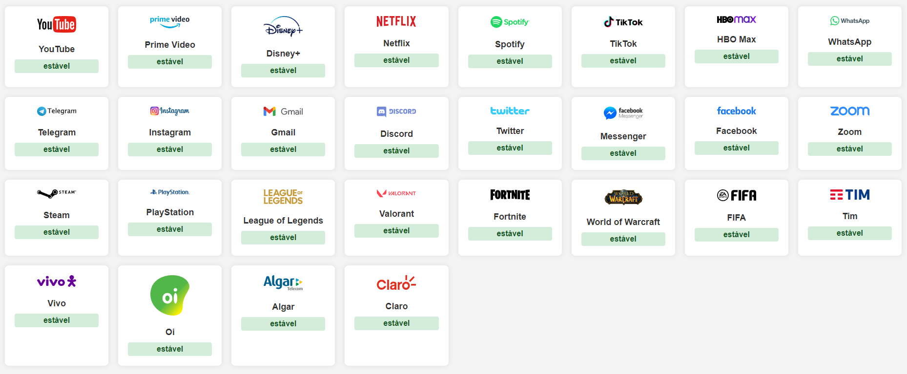

# Content Monitor 🔍



## 📖 Descrição
**Content monitor** é uma aplicação desenvolvida em **FastAPI** usando técnicas de web scraping para verificar o status de serviços populares (como Netflix, WhatsApp, etc.) usando os dados do site [IsTheServiceDown?](https://istheservicedown.com.br).  
Ele retorna informações sobre a disponibilidade dos serviços, classificando-os como estáveis ou instavéis.

---

## 🛠️ Funcionalidades
- **Consulta rápida:** Obtenha o status de qualquer serviço suportado pela URL do site.
- **Proxy support:** Utiliza proxies (em desenvolvimento) para evitar bloqueios e melhorar o desempenho em múltiplas consultas.
- **Configuração simples:** Fácil de instalar e rodar em ambiente Windows.

- **UI Amigável:** Ui simples e clean, dando as informações da forma fácil e sem complicações.

---

## 🚀 Como Usar

### Pré-requisitos
- **Python 3.12+**
- **Pip**
- Sistema Windows (suporte para Linux em desenvolvimento).
- Libs como Bs4, 

### Configuração
1. Clone o repositório:
   ```bash
   git clone https://github.com/tas48/content-monitor.git
   cd content-monitor
   ```
2. Crie o ambiente virtual (venv) e a ative:
   ```bash
   python3 -m venv venv
   venv\Scripts\activate
   ```
3. Instale as dependencias
    ```bash
   pip install -r requirements.txt
   ```
4. Execute o script para ativar a aplicação:
    ```bash
   ./start.bat
   ```
## 📋 Coisas a Fazer (To-Do List)
 - Adicionar suporte para Linux.
 - Implementar lista de proxies para evitar bloqueios.
 - Melhorar tratamento de erros para casos de serviços não encontrados.
 - Aumentar a lista de sites fonte(source) para obter mais acurácia

## 🤝 Contribuindo
- Contribuições são bem-vindas!
- Relate problemas: Abra uma issue no GitHub.
- Melhorias: Envie pull requests com novos recursos ou ajustes.